# LangGraph Agent on Amazon Bedrock AgentCore

This project demonstrates how to build and deploy a conversational AI agent using [LangGraph](https://github.com/langchain-ai/langgraph) and [Amazon Bedrock AgentCore](https://aws.amazon.com/bedrock/agentcore/). The agent is powered by Claude (via an Amazon Bedrock application inference profile) and exposes two tools — a **calculator** for mathematical expressions and a **weather** tool — orchestrated through a LangGraph state machine.

The agent is containerized with Docker and deployed to Amazon Bedrock AgentCore Runtime, which handles scaling, execution, and endpoint management automatically.

### Tech Stack
- LangGraph + LangChain AWS for agent orchestration
- Amazon Bedrock (Claude via application inference profile)
- Amazon Bedrock AgentCore Runtime for deployment
- Amazon ECR for container image storage

---

### Deploy a inference Model in Amazon Bedrock


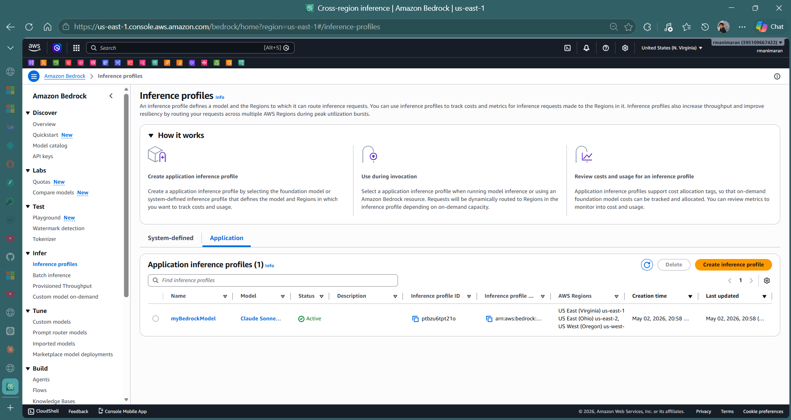

### Run the application
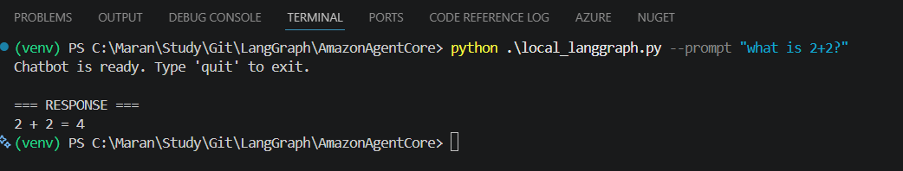

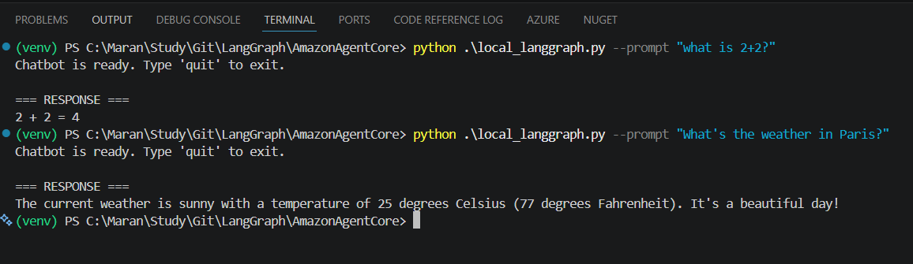

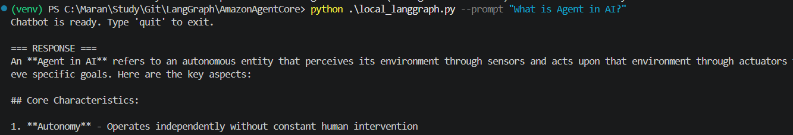

Create Docker and Deploy
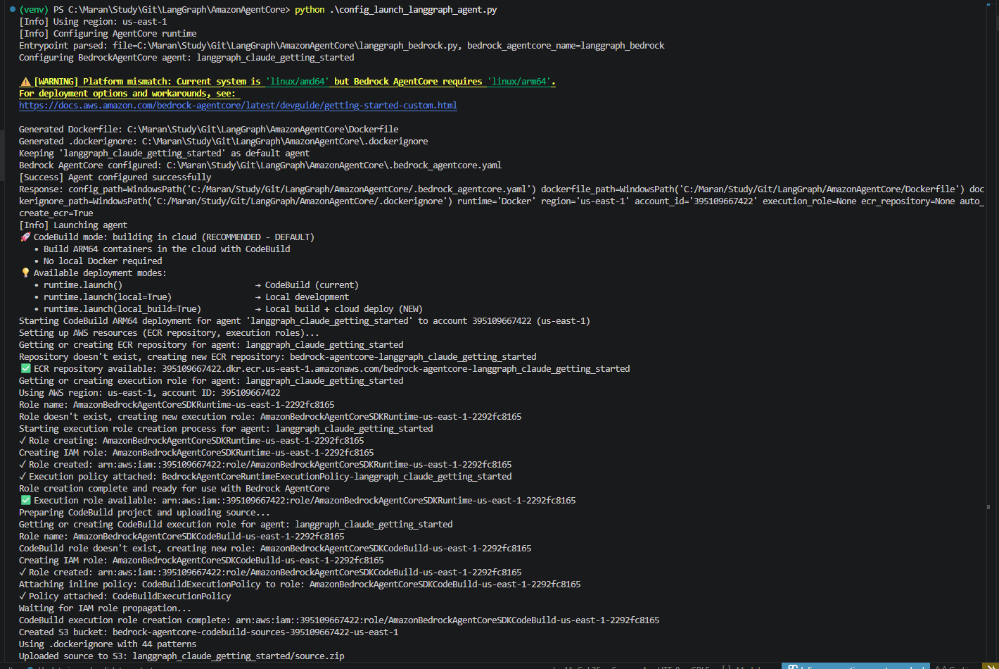

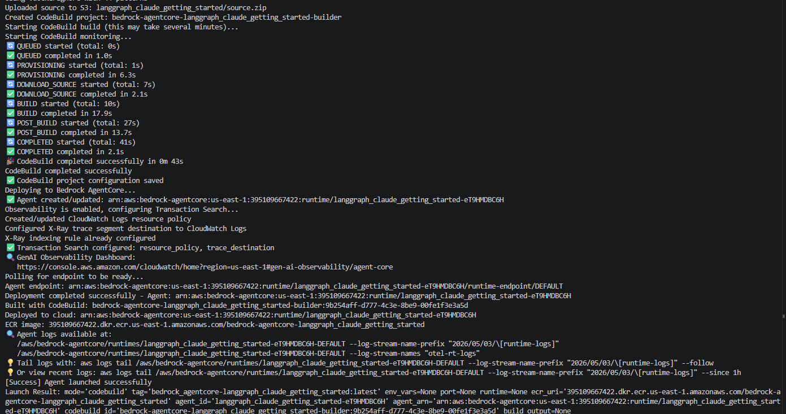

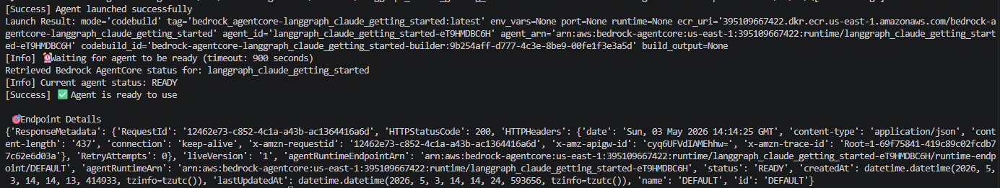

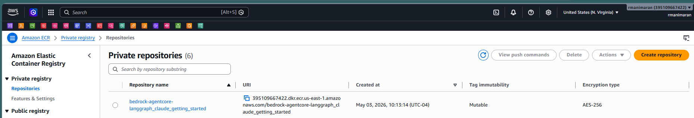

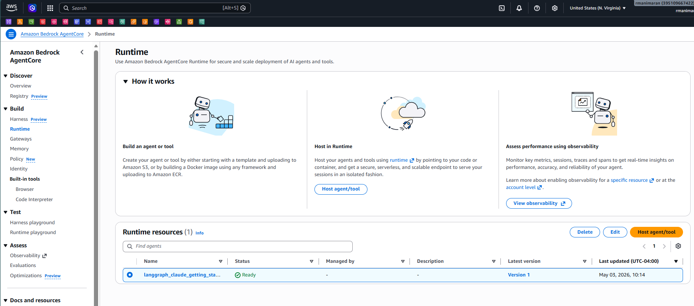


## Associate the inline Policy

```bash
aws iam put-role-policy \
  --role-name AmazonBedrockAgentCoreSDKRuntime-us-east-1-2292fc8165 \
  --policy-name BedrockInferenceProfileAccess \
  --policy-document '{
    "Version": "2012-10-17",
    "Statement": [
      {
        "Effect": "Allow",
        "Action": [
          "bedrock:GetInferenceProfile",
          "bedrock:InvokeModel",
          "bedrock:InvokeModelWithResponseStream"
        ],
        "Resource": [
          "arn:aws:bedrock:us-east-1:395109667422:application-inference-profile/ptbzu6tpt21o",
          "arn:aws:bedrock:us-east-1::foundation-model/*"
        ]
      }
    ]
  }'
```

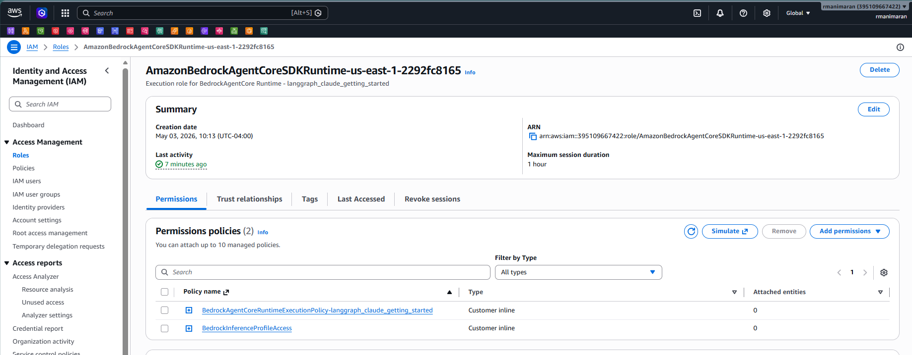

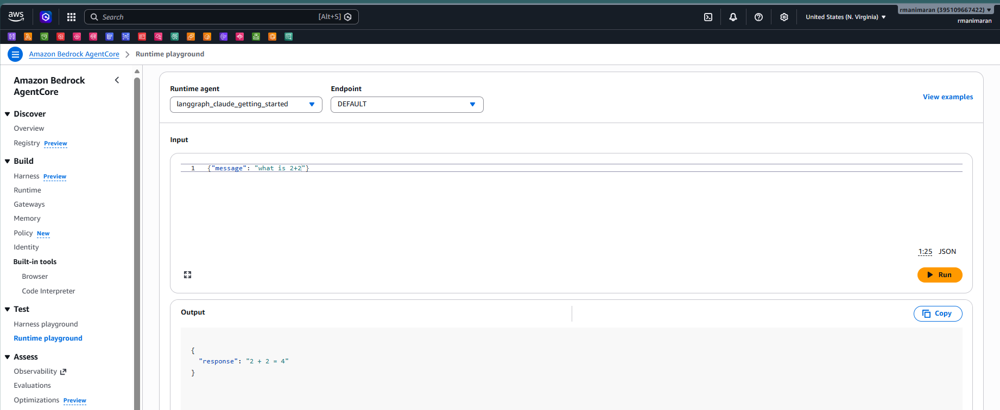

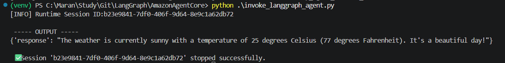


---

## Opportunities for Improvement & Additional Capabilities

### Tools & Integrations
- **Real weather API** — Replace the mock weather tool with a live provider (e.g. OpenWeatherMap, AWS Weather) to return actual forecasts
- **Database tool** — Add a tool that queries Amazon RDS or DynamoDB to let the agent answer data-driven questions
- **Web search tool** — Integrate a search API (e.g. Tavily, Brave Search) so the agent can retrieve up-to-date information from the web
- **Document retrieval (RAG)** — Connect Amazon Bedrock Knowledge Bases to give the agent access to your own documents and knowledge

### Agent Capabilities
- **Conversation memory** — Persist chat history across sessions using Amazon DynamoDB or Amazon ElastiCache so the agent remembers prior context
- **Multi-agent orchestration** — Compose multiple specialised LangGraph agents (e.g. a research agent + a coding agent) using LangGraph's multi-agent patterns
- **Streaming responses** — Enable token-level streaming from Bedrock (`InvokeModelWithResponseStream`) for a more responsive user experience
- **Human-in-the-loop** — Add LangGraph interrupt nodes to pause execution and request human approval before sensitive actions

### Security & Reliability
- **Input validation** — Add a schema (e.g. Pydantic) to validate and sanitise the incoming payload before passing it to the agent
- **Guardrails** — Attach Amazon Bedrock Guardrails to the inference profile to enforce content filtering and topic restrictions
- **Retry & fallback logic** — Wrap LLM calls with exponential backoff and a fallback model in case of throttling or model unavailability

### Observability & Operations
- **Structured logging** — Emit structured JSON logs to Amazon CloudWatch for easier querying and alerting
- **Tracing** — Use AWS X-Ray or LangSmith to trace individual agent steps and tool calls end-to-end
- **CI/CD pipeline** — Automate Docker build, ECR push, and AgentCore deployment using AWS CodePipeline or GitHub Actions
